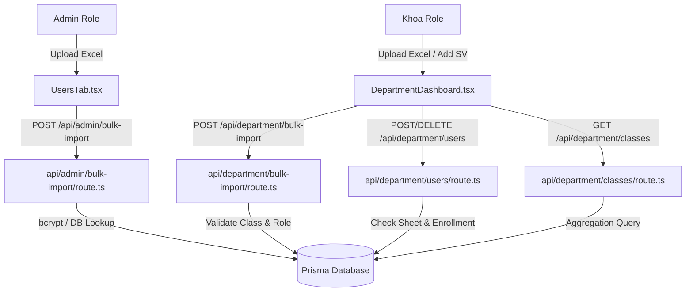

# Đánh Giá Chi Tiết Hệ Thống: Import Excel & Quản Lý Sinh Viên

Tài liệu này cung cấp cái nhìn chi tiết và toàn diện về các file được thêm mới hoặc chỉnh sửa trong đợt phát triển vừa qua. Nội dung tập trung vào chức năng, cơ chế hoạt động, luồng xử lý dữ liệu và tích hợp cơ sở dữ liệu cho cả vai trò **Quản trị viên (Admin)** và **Ban lãnh đạo Khoa (Department)**.

---

## 📌 Sơ Đồ Kiến Trúc Luồng Dữ Liệu (Data Flow)



---

## 🗂️ Danh Sách Các File Phục Vụ Tính Năng

Hệ thống được tổ chức thành 2 lớp chính: **API Routes (Backend)** và **Frontend Components**.

### 1. Lớp API Routes (Backend)
- [packages/web/app/api/admin/bulk-import/route.ts](file:///d:/duan/packages/web/app/api/admin/bulk-import/route.ts) — API Import Excel cho Admin.
- [packages/web/app/api/department/bulk-import/route.ts](file:///d:/duan/packages/web/app/api/department/bulk-import/route.ts) — API Import Excel cho Khoa.
- [packages/web/app/api/department/classes/route.ts](file:///d:/duan/packages/web/app/api/department/classes/route.ts) — API lấy danh sách lớp của Khoa.
- [packages/web/app/api/department/users/route.ts](file:///d:/duan/packages/web/app/api/department/users/route.ts) — API Thêm, Xóa, Liệt kê sinh viên theo lớp.

### 2. Lớp Giao Diện (Frontend)
- [packages/web/app/admin/UsersTab.tsx](file:///d:/duan/packages/web/app/admin/UsersTab.tsx) — Quản lý tài khoản Admin & Giao diện Import Excel.
- [packages/web/app/components/DepartmentDashboard.tsx](file:///d:/duan/packages/web/app/components/DepartmentDashboard.tsx) — Dashboard Khoa: Thống kê, Báo cáo và Quản lý sinh viên.
- [packages/web/app/components/DashboardLayout.tsx](file:///d:/duan/packages/web/app/components/DashboardLayout.tsx) — Khung bố cục và thanh điều hướng động theo vai trò.
- [packages/web/app/department/page.tsx](file:///d:/duan/packages/web/app/department/page.tsx) — Trang chính của Khoa hỗ trợ Suspense boundary.

---

## 🔍 Đánh Giá Chi Tiết Từng File & Cơ Chế Hoạt Động

---

### 1. API Route: `api/admin/bulk-import/route.ts`
* **Đường dẫn vật lý:** `packages/web/app/api/admin/bulk-import/route.ts`
* **Mục đích:** Xử lý yêu cầu POST chứa dữ liệu JSON được parse từ Excel gửi lên bởi tài khoản Admin để đăng ký hàng loạt người dùng với nhiều vai trò khác nhau.

#### ⚙️ Cách thức hoạt động & Luồng xử lý:
1. **Kiểm tra quyền hạn:** Gọi `getServerSession(authOptions)` để lấy thông tin đăng nhập. Chỉ tài khoản có `role === 'SCHOOL_ADMIN'` mới được phép tiếp tục, các vai trò khác bị trả về lỗi `403 Forbidden`.
2. **Kiểm tra giới hạn dữ liệu:** Giới hạn tối đa **500 dòng** trong một yêu cầu để tránh quá tải bộ nhớ và timeout kết nối.
3. **Nạp dữ liệu tra cứu (Pre-fetching):**
   - Lấy toàn bộ danh sách Khoa (Departments) và Lớp (Classes) trong hệ thống để tìm kiếm ánh xạ từ mã Excel.
   - Tìm học kỳ đang hoạt động (`is_active: 1`) để tự động gán sinh viên vào học kỳ hiện tại.
   - Truy vấn toàn bộ email và MSSV hiện tại để tạo cấu trúc `Set` hỗ trợ tìm kiếm trùng lặp nhanh trong thời gian thực $O(1)$.
4. **Xử lý từng dòng dữ liệu (Vòng lặp):**
   - **Validation:** Bắt buộc phải có `full_name`, `email`, và `password`. Kiểm tra vai trò có thuộc các enum hợp lệ (`STUDENT`, `CLASS_COMMITTEE`, `ADVISOR`, `DEPARTMENT`, `SCHOOL_ADMIN`).
   - **Kiểm tra trùng lặp kép:** So khớp email/MSSV với dữ liệu hiện có trong Database **VÀ** với các dòng trước đó trong cùng file Excel vừa xử lý (tránh trường hợp file chứa dữ liệu trùng lặp nội bộ).
   - **Ánh xạ Khoa & Lớp:** Ánh xạ mã khoa (`department_code`) hoặc tên khoa để lấy `department_id`. Ánh xạ mã lớp (`class_code`) để lấy `class_id`. Nếu có lớp nhưng thiếu khoa, hệ thống tự động kế thừa khoa từ lớp đó.
   - **Lưu trữ dữ liệu:**
     - Hash mật khẩu bằng thư viện `bcrypt` với muối (salt) 10 vòng.
     - Tạo người dùng mới trong bảng `users` với ID ngẫu nhiên UUID.
     - Nếu có chỉ định lớp (`classId`) và học kỳ đang hoạt động, hệ thống sẽ chèn thêm một dòng đăng ký vào bảng `semester_enrollments` để xếp lớp cho sinh viên.
5. **Phản hồi:** Trả về mã lỗi/thành công kèm theo chỉ số dòng cụ thể từ Excel giúp giao diện highlight chính xác.

---

### 2. API Route: `api/department/bulk-import/route.ts`
* **Đường dẫn vật lý:** `packages/web/app/api/department/bulk-import/route.ts`
* **Mục đích:** Nhập hàng loạt tài khoản sinh viên thuộc quyền quản lý của một Khoa cụ thể.

#### ⚙️ Cách thức hoạt động & Luồng xử lý:
1. **Ràng buộc vai trò:** Chỉ cho phép người dùng đăng nhập có `role === 'DEPARTMENT'` truy cập. Hệ thống lấy ra `department_id` của tài khoản Khoa này.
2. **Kiểm soát phạm vi dữ liệu:**
   - Chỉ cho phép tạo tài khoản có vai trò `STUDENT`.
   - Lớp học được gán cho sinh viên bắt buộc phải là lớp thuộc Khoa của tài khoản đang đăng nhập. Nếu class trong excel hoặc classId được chọn không hợp lệ hoặc thuộc khoa khác, hệ thống sẽ từ chối dòng dữ liệu đó.
3. **Phân loại lớp:**
   - Hệ thống chấp nhận tham số `classId` truyền chung cho cả lô hàng (nếu đang ở giao diện quản lý của một lớp cụ thể).
   - Hoặc đọc cột `Lớp` (`class_code`) riêng lẻ trên từng dòng Excel. Cột riêng lẻ này sẽ có quyền ưu tiên cao hơn tham số chung.
4. **Tạo tài khoản và Gán lớp:** Thực hiện hash mật khẩu, tạo user trong bảng `users` (được gắn kèm `department_id` của Khoa), sau đó liên kết vào bảng `semester_enrollments`.

---

### 3. API Route: `api/department/classes/route.ts`
* **Đường dẫn vật lý:** `packages/web/app/api/department/classes/route.ts`
* **Mục đích:** Cung cấp danh sách lớp học thuộc sự quản lý của Khoa phục vụ cho dropdown bộ lọc ở frontend.

#### ⚙️ Cách thức hoạt động:
- Xác thực người dùng có quyền Khoa.
- Thực hiện câu lệnh tìm kiếm trong bảng `classes` với điều kiện lọc `department_id === user.department_id` và `is_active: 1`.
- Sử dụng tính năng đếm quan hệ của Prisma (`_count`) để lấy số lượng sinh viên đã đăng ký vào mỗi lớp học trong kỳ hiện tại:
  ```typescript
  _count: { select: { semester_enrollments: true } }
  ```
- Kết quả trả về gồm: ID lớp, Mã lớp, Tên lớp, và Sĩ số lớp.

---

### 4. API Route: `api/department/users/route.ts`
* **Đường dẫn vật lý:** `packages/web/app/api/department/users/route.ts`
* **Mục đích:** Cung cấp 3 hành động quản lý học viên trực tiếp: Xem danh sách lớp (GET), Thêm thủ công (POST), và Xóa khỏi lớp (DELETE).

#### ⚙️ Cách thức hoạt động của từng phương thức:
- **`GET` (Lấy danh sách sinh viên theo lớp):**
  - Nhận tham số `classId` từ query string.
  - Xác thực lớp này thuộc Khoa của user hiện tại.
  - Lấy học kỳ đang kích hoạt và truy vấn các bản ghi trong `semester_enrollments` khớp với `class_id` và `semester_id`, sau đó kết nối (join) sang thông tin chi tiết của bảng `users` để hiển thị.
- **`POST` (Thêm sinh viên thủ công):**
  - Nhận `full_name`, `email`, `password`, `student_id` (MSSV) và `class_id`.
  - Kiểm tra trùng lặp email/MSSV trên toàn hệ thống.
  - Tạo tài khoản user mới với role `STUDENT` và liên kết với `department_id` của khoa.
  - Xếp lớp cho sinh viên bằng cách thêm vào bảng `semester_enrollments` ứng với kỳ học hiện tại.
- **`DELETE` (Xóa sinh viên khỏi lớp):**
  - Nhận tham số `enrollmentId` (ID của bản đăng ký học kỳ, **không phải** ID của User).
  - **Kiểm tra an toàn dữ liệu (Critical):** Hệ thống truy vấn bảng `scoring_sheets` xem sinh viên này đã có phiếu đánh giá điểm rèn luyện nào liên kết với bản đăng ký này chưa. Nếu đã có dữ liệu chấm điểm, hệ thống sẽ chặn hành động xóa và trả về thông báo lỗi để tránh mất mát dữ liệu điểm số.
  - Nếu hợp lệ, hệ thống thực hiện xóa bản ghi đăng ký khỏi bảng `semester_enrollments`. Tài khoản gốc của sinh viên trong bảng `users` vẫn được giữ lại để tránh ảnh hưởng đến các dữ liệu lịch sử hoặc các kỳ học khác.

---

### 5. Frontend Component: `UsersTab.tsx`
* **Đường dẫn vật lý:** `packages/web/app/admin/UsersTab.tsx`
* **Mục đích:** Cung cấp giao diện quản lý tài khoản tập trung cho Admin, tích hợp công cụ Import hàng loạt thông minh.

#### 🎨 Thiết kế & Trải nghiệm người dùng (UX):
- **Tích hợp thư viện `xlsx` (SheetJS):** Mọi công đoạn đọc, giải mã tệp tin Excel đều diễn ra trực tiếp ở phía client (trình duyệt của người dùng). File không bị tải thô lên máy chủ giúp bảo vệ băng thông và tăng tốc độ xử lý.
- **Tải tệp mẫu tự động:** Tích hợp hàm `downloadTemplate` tạo nhanh file mẫu `.xlsx` chuẩn hóa các cột ngay trong bộ nhớ và tải xuống máy chủ người dùng chỉ với 1 click.
- **Bảng xem trước thông minh (Preview Table):**
  - Hiển thị toàn bộ dữ liệu Excel dạng bảng trước khi xác nhận lưu.
  - Phát hiện các dòng lỗi logic cơ bản (như thiếu Họ tên, Email, Mật khẩu) và tô màu nền đỏ cảnh báo trực quan.
- **Báo cáo kết quả trực quan:** Khi bấm nộp, giao diện hiển thị bảng thống kê kết quả (Tổng số dòng, Số dòng thành công, Số dòng lỗi). Các dòng lỗi được liệt kê kèm theo lý do cụ thể (Ví dụ: *"Email đã tồn tại"*, *"Mã khoa không tồn tại"*).

---

### 6. Frontend Component: `DepartmentDashboard.tsx`
* **Đường dẫn vật lý:** `packages/web/app/components/DepartmentDashboard.tsx`
* **Mục đích:** Giao diện trung tâm cho ban lãnh đạo khoa để theo dõi tiến độ và quản lý sinh viên.

#### 📊 Cấu trúc 3 Tab chức năng:
1. **Thống kê tổng quan (Summary):**
   - Hiển thị 4 thẻ chỉ số chính sử dụng màu sắc Gradient hiện đại: Tổng số sinh viên, Điểm trung bình toàn khoa, Số lượng sinh viên đạt loại Giỏi/Xuất sắc, Tiến độ nộp phiếu (Đã nộp / Đã duyệt).
   - Bảng tổng hợp các lớp học: Cho biết sĩ số từng lớp, tỷ lệ nộp phiếu chấm điểm, điểm trung bình lớp và cơ cấu xếp loại.
   - **Tính năng chuyển vùng thông minh:** Bảng này hỗ trợ tương tác. Khi nhấp chuột vào một dòng lớp học bất kỳ, hệ thống sẽ tự động chuyển sang tab "Chi tiết lớp học" và tự động lọc theo lớp đó.
2. **Chi tiết lớp học (Classes):**
   - Cho phép chọn lớp cụ thể hoặc xem toàn bộ khoa.
   - Tìm kiếm nhanh sinh viên bằng Tên hoặc MSSV.
   - Hiển thị chi tiết điểm số của 3 cấp đánh giá: Sinh viên tự chấm, Ban cán sự lớp chấm, Cố vấn học tập chấm, kèm theo nhãn xếp loại màu sắc tương ứng.
3. **Quản lý sinh viên (Manage):**
   - Giao diện thêm sinh viên thủ công bằng form modal.
   - Nút xóa học viên ra khỏi lớp học kỳ hiện tại.
   - **Tích hợp Import Excel cấp Khoa:** Tương tự như Admin nhưng được tối ưu hóa cho Khoa:
     - Tự động nhận diện lớp học đang chọn ở ngoài bộ lọc để gán cho danh sách sinh viên import (không bắt buộc nhập cột Lớp trong Excel).
     - Khóa cứng vai trò tạo thành `STUDENT`.
     - Lọc và báo cáo lỗi các dòng không thuộc quyền quản lý của khoa.

#### 📤 Chức năng Xuất Báo Cáo đa định dạng:
Giao diện tích hợp menu xuất dữ liệu hỗ trợ 3 định dạng xuất bản:
- **CSV (.csv):** Hỗ trợ chèn mã UTF-8 BOM (`\uFEFF`) giúp các phiên bản Microsoft Excel hiển thị đúng tiếng Việt có dấu không bị lỗi font.
- **Excel (.xls):** Tạo trực tiếp cấu trúc bảng HTML trong bộ nhớ và xuất file nhị phân tương thích Excel.
- **PDF / Bản in:** Tạo cửa sổ in tạm thời (`window.print()`) thiết lập sẵn CSS để xuất dữ liệu sạch không chứa thanh công cụ hay sidebar của web.

---

### 7. Frontend Component: `DashboardLayout.tsx`
* **Đường dẫn vật lý:** `packages/web/app/components/DashboardLayout.tsx`
* **Mục đích:** Thiết lập bố cục chung của trang Dashboard, quản lý Sidebar điều hướng.

#### 🛠️ Các điểm cải tiến cốt lõi:
- **Phân quyền thanh menu động:** Bổ sung mục **"Quản lý sinh viên"** vào danh mục điều hướng riêng của vai trò `DEPARTMENT`:
  ```typescript
  DEPARTMENT: [
    { label: 'Bảng tổng hợp', href: '/department', icon: ... },
    { label: 'Quản lý sinh viên', href: '/department?tab=manage', icon: ... }
  ]
  ```
- **Xử lý trạng thái Active chuẩn:** Phân tích pathname và các query string (`searchParams`) để làm sáng menu tương ứng (Ví dụ: làm sáng mục "Quản lý sinh viên" khi URL có tham số `?tab=manage`).

---

### 8. Frontend Page: `department/page.tsx`
* **Đường dẫn vật lý:** `packages/web/app/department/page.tsx`
* **Mục đích:** Điểm truy cập cho route `/department`.

#### ⚙️ Cơ chế hoạt động:
- Sử dụng thẻ `<Suspense>` bao bọc component `DepartmentDashboard`. 
- Việc bao bọc này là bắt buộc trong Next.js App Router khi component con có sử dụng Hook `useSearchParams` để phân tích URL, giúp trang web không bị lỗi render phía máy chủ (SSR) và đảm bảo quá trình tải trang mượt mà.

---

## 💾 Kiến Trúc Tích Hợp Cơ Sở Dữ Liệu

Mô hình dữ liệu của hệ thống được tổ chức theo chuẩn hóa 3NF để đảm bảo tính toàn vẹn và tối ưu hóa việc quản lý lịch sử học tập qua các học kỳ.

### 📐 Mối Quan Hệ Bảng:
1. Bảng **`users`**: Lưu thông tin cốt lõi của tất cả người dùng (Admin, Khoa, Cố vấn, BCS, Sinh viên). Bảng này **không lưu trực tiếp** thông tin lớp học (`class_id`), vì một sinh viên có thể thay đổi lớp hoặc đăng ký các lớp khác nhau qua từng kỳ. Bảng chỉ lưu liên kết đến Khoa (`department_id`).
2. Bảng **`classes`**: Định nghĩa lớp học sinh hoạt, thuộc về một khoa nhất định.
3. Bảng **`semester_enrollments`** (Bảng trung gian):
   - Đóng vai trò cầu nối liên kết `users` (sinh viên) với `classes` (lớp học) cho một `semesters` (học kỳ) xác định.
   - Mọi hoạt động thống kê điểm rèn luyện, tìm kiếm sinh viên theo lớp đều phải đi qua liên kết của bảng trung gian này.
4. Bảng **`scoring_sheets`**:
   - Lưu trữ kết quả điểm rèn luyện và liên kết trực tiếp với bản ghi đăng ký thông qua khóa ngoại `enrollment_id`.
   - Đây là lý do khi xóa sinh viên khỏi lớp, hệ thống kiểm tra sự tồn tại của phiếu điểm trong bảng này trước để đảm bảo tính toàn vẹn dữ liệu.

---

## 🧩 Quy Tắc Mapping Cột Excel Hỗ Trợ Đa Dạng

Hệ thống hỗ trợ ánh xạ thông minh từ các tiêu đề cột tiếng Việt hoặc tiếng Anh trong Excel về các thuộc tính trong Database:

| Tiêu đề trong file Excel nhận diện được | Thuộc tính đích | Ghi chú |
| :--- | :--- | :--- |
| `MSSV`, `mssv`, `Mã SV` | `student_id` | Mã số sinh viên (Duy nhất) |
| `Họ tên`, `Ho ten`, `Họ và tên` | `full_name` | Họ và tên sinh viên |
| `Email`, `email` | `email` | Địa chỉ thư điện tử (Duy nhất) |
| `Mật khẩu`, `Mat khau`, `Password` | `password` | Mật khẩu gốc (Sẽ được hash khi lưu) |
| `Vai trò`, `Vai tro`, `Role` | `role` | Phân loại vai trò người dùng |
| `Khoa`, `Mã khoa`, `Department` | `department_code` | Mã định danh Khoa |
| `Lớp`, `Mã lớp`, `Class` | `class_code` | Mã định danh lớp sinh hoạt |

### Ánh xạ tên vai trò (Role Mapping):
Hệ thống tự động chuẩn hóa các cách ghi vai trò khác nhau về dạng chuẩn lưu trữ:
- **`STUDENT`**: Nhận các từ khóa như *"sinh viên"*, *"sv"*, *"student"*.
- **`CLASS_COMMITTEE`**: Nhận *"ban cán sự"*, *"bcs"*, *"class_committee"*.
- **`ADVISOR`**: Nhận *"cố vấn"*, *"cvht"*, *"advisor"*.
- **`DEPARTMENT`**: Nhận *"khoa"*, *"department"*.
- **`SCHOOL_ADMIN`**: Nhận *"admin"*, *"school_admin"*.

---

## 🛠️ Bản vá: Sửa lỗi tiêu chí điểm trừ (Deduction Validation Fix)

### Vấn đề:
Khi sinh viên hoặc cán bộ đánh giá thực hiện tự chấm điểm cho các tiêu chí thuộc loại **DEDUCTION (Điểm trừ)** (ví dụ: tiêu chí `1.1.3` hoặc `4.3` có mức trừ tối đa `max_points = -2`, `min_score = 0`), hệ thống sẽ phát sinh lỗi chặn lưu:
> *Lỗi: Lưu được 47 tiêu chí, 6 bị lỗi: Điểm không được vượt quá -2 (tiêu chí "4.3")*

**Nguyên nhân:**
Mã nguồn cũ kiểm tra điều kiện validation của tiêu chí theo toán tử toán học mặc định:
```typescript
if (score > criteria.max_points) { ... }
```
Khi tiêu chí là điểm trừ, `max_points` có giá trị âm (ví dụ: `-2`). Bất kỳ điểm số hợp lệ nào của người dùng như `0` hoặc `-1` đều có giá trị lớn hơn `-2` (`0 > -2`), do đó đều bị chặn lại và báo lỗi toán học. Đồng thời, điều kiện `score < min_score` (với `min_score = 0`) cũng chặn tất cả các giá trị trừ âm thực tế (như `-1`, `-2`).

### Giải pháp khắc phục:

1. **API Backend ([scoring.service.ts](file:///d:/duan/packages/api/src/modules/scoring/scoring.service.ts)):**
   Tách biệt hoàn toàn luồng kiểm tra logic giữa tiêu chí **Điểm cộng (Thông thường)** và **Điểm trừ (DEDUCTION)**:
   - Với **Điểm trừ (Deduction)** hoặc khi `max_points < 0`:
     - Điểm không được thấp hơn mức phạt tối đa (`score < criteria.max_points`, ví dụ: không được nhập `-3` đối với tiêu chí tối đa `-2`).
     - Điểm không được vượt quá mức phạt tối thiểu (`score > criteria.min_score`, ví dụ: không được nhập `1` đối với tiêu chí phạt).
   - Với **Điểm cộng (Thông thường)**:
     - Giữ nguyên logic kiểm tra trong khoảng `[min_score, max_points]`.

2. **Giao diện Client ([ScoringForm.tsx](file:///d:/duan/packages/web/app/components/ScoringForm.tsx)):**
   - Điều chỉnh thẻ input nhập điểm để tự động đổi thuộc tính `min` và `max` khi phát hiện tiêu chí điểm trừ:
     - Nếu là điểm trừ: `min = max_points` (ví dụ: `-2`), `max = 0`.
     - Nếu là điểm cộng: `min = 0`, `max = max_points`.
   - Cập nhật hàm `handleSaveRow` để chặn kiểm tra hợp lệ phù hợp với hai khoảng giá trị này.
